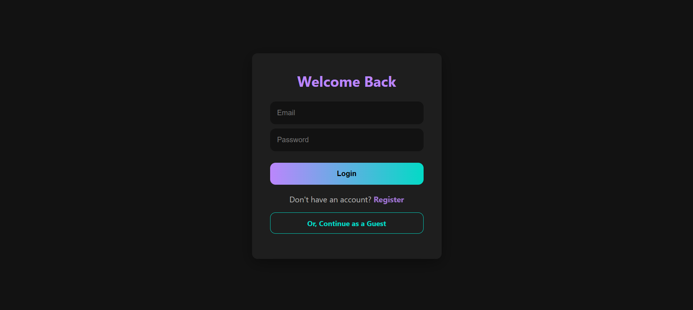
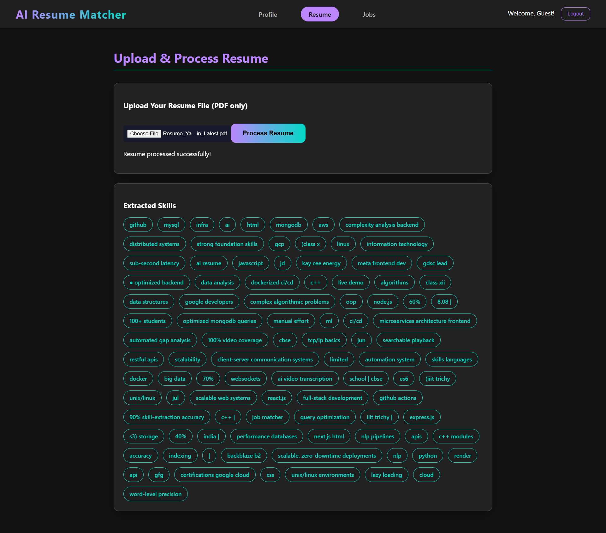
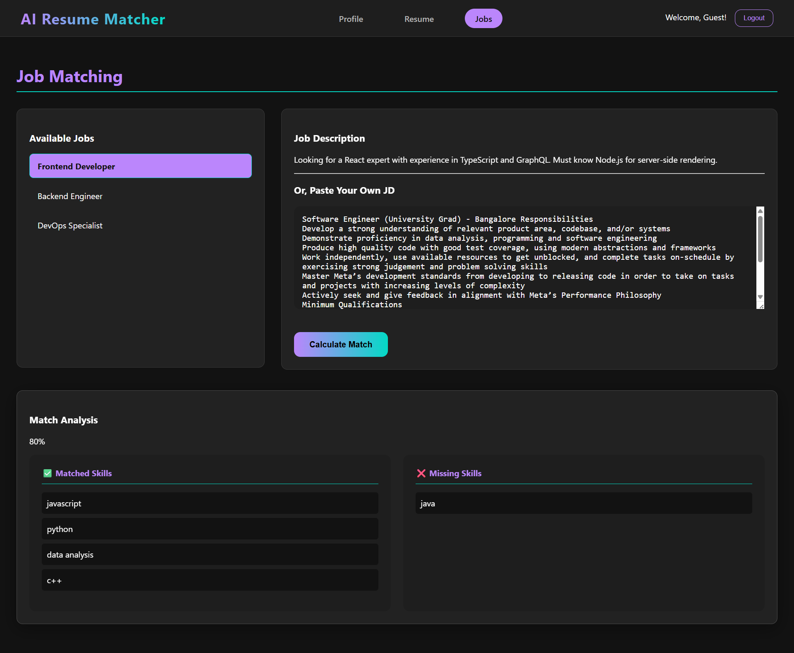

# 🧠 AI Resume Matcher

An **AI-powered microservice application** that automates resume–job matching. The system intelligently parses resumes, extracts skills using **Natural Language Processing (NLP)**, and generates dynamic match scores for job descriptions — streamlining recruitment with accuracy and speed.

**🔴 Live Demo:** [Link to the Deployed App](https://ai-resume-matcher-plum.vercel.app/)

---

## ✨ Key Features

- **AI-Powered Skill Extraction:** Uses a dedicated **Python + Flask + spaCy** NLP microservice to identify core technical and soft skills from PDF resumes and job descriptions.
- **Dynamic Match Scoring:** Computes a **real-time percentage match** between a candidate’s resume and job description, with skill-gap analysis.  
- **Secure JWT Authentication:** Includes complete **user authentication and protected APIs** using JSON Web Tokens.  
- **Full-Stack Microservice Architecture:** Built with a **React frontend, Node.js backend, and Python NLP service**, deployed independently for scalability. 
- **Cloud-Native Deployment:** Frontend hosted on **Vercel**, backend and NLP services on **Render**, and database on **MongoDB Atlas**.  
- **Modern, Responsive UI:** Intuitive **dark-themed interface** built with React and Vite for smooth performance.  

---

## 🛠️ Tech Stack & Architecture

| Component | Technology |
|-------|-------------|
| **Frontend** |   |
| **Backend API** |   |
|**NLP Service**|    |
| **Database** |  |
| **Deployment** |   |

---

## ⚙️ System Overview
1. **React Frontend (Vercel):** Handles authentication, resume uploads, and displays skill match scores.

2. **Node.js Backend (Render):** Manages users, JWT-based sessions, and routes NLP requests.

3. **Python NLP Service (Render):** Uses **spaCy** to extract relevant skills and return structured data to the backend.

---

## 🖼️ Screenshots

#### Authentication 



#### Resume Upload



#### Job Matching



---

## 🚀 Local Setup 

### 1️⃣ Clone Repository
```bash
git clone https://github.com/Yash-Jain24/AI-Resume-Matcher.git
cd AI-Resume-Matcher
```

### 2️⃣ Setup Python NLP Service
```bash
cd nlp-microservice
pip install -r requirements.txt
python app.py
# Runs on http://localhost:5002
```

### 3️⃣ Setup Backend API
```bash
cd ../backend
npm install
# Create a .env file
npm start
# Runs on http://localhost:5001
```
### 4️⃣ Setup Frontend
```bash
cd ../frontend
npm install
npm run dev
# Runs on http://localhost:5173
```
---

### 🔑 Environment Variables

#### `/backend/.env`
```bash
MONGO_URI=your_mongodb_atlas_connection_string
JWT_SECRET=your_super_secret_token_string
SPACY_SERVICE_URL=http://localhost:5002
```
#### `/frontend/.env.local`
```bash
VITE_API_URL=http://localhost:5001/api
```

---

## 🌩️ Deployment

- **Frontend** → Deployed on **Vercel** directly from `/frontend`.
- **Backend & NLP Service** → Deployed as independent **Render web services**.
- **Database** → Hosted on **MongoDB Atlas** (Free Tier Cluster).

Each service follows its own CI/CD pipeline for seamless updates and scalability.

---

## 🤝 Contributing
Contributions and feature suggestions are welcome — open an issue or pull request.

## 📄 License
Licensed under the **MIT License**.

---

## 👨‍💻 Author
[Github](https://github.com/Yash-Jain24) | [LinkedIn](https://www.linkedin.com/in/yashjain24)